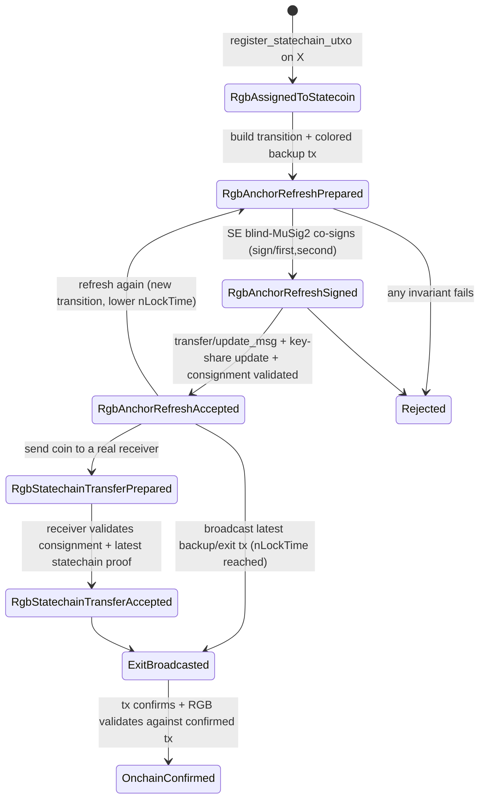

# RGB anchor refresh via statechain self-transfer

This document specifies how an RGB state transition can be **committed inside a Mercury statechain
without an on-chain Bitcoin transaction**, by performing a *self-transfer* of the statechain coin.
It is written against the **actual code** in this repo; the high-level proposal's invented
function/struct names are mapped to the real ones here.

## The idea in one paragraph

A statechain coin is the funding output `Tx0:vout` (call it **X**) that stays unspent on Bitcoin.
Every Mercury transfer produces a *new* server-co-signed **backup transaction** that spends **X**,
pays the new owner, and has its `nLockTime` decremented by `interval` (see
[`docs/transfer_sender_sequence.md`](transfer_sender_sequence.md): *"set nLocktime = nLocktime -
interval"*). The latest backup tx is therefore the **earliest broadcastable** spend of X — the one
that wins the race to close X's single-use RGB seal. To **refresh the RGB commitment** we transfer
the coin **from the owner to the owner** (a *self-transfer*): the new backup tx spends the same X,
carries a **new RGB commitment** (an opret/OP_RETURN over a new RGB transition), is blind-MuSig2
co-signed by the SE, and the owner's key-share is rotated — exactly like a normal transfer. Nothing
is broadcast. The RGB seal on X is *not* closed on Bitcoin yet, but the latest enforceable exit tx
now commits to the new RGB state.

> This is the RGB-over-Lightning model with the statechain playing the role of the LN funding output:
> multiple commitment txs spend the same outpoint; only the latest (lowest `nLockTime`, freshest
> key-share) is the one a cooperating SE will help broadcast, and it carries the live RGB anchor.

## Two notions of finality

| | Closed how | When |
|---|---|---|
| **Statechain-accepted RGB** | the latest SE-co-signed backup/exit tx *can* spend X and commits the expected RGB transition | immediately after the self-transfer + key-share update — **no broadcast** |
| **Bitcoin-confirmed RGB** | the backup/exit tx actually spent X and confirmed | only after `exit` broadcasts the latest backup tx and it confirms |

A wallet must **never** treat a refreshed transition as Bitcoin-confirmed until the exit tx confirms.

## Mapping the proposal to the real code

| Proposal concept | Real code in this repo |
|---|---|
| `refresh_rgb_anchor_self_transfer(...)` | a self-transfer: [`transfer_receiver::new_transfer_address`](../clients/libs/rust/src/transfer_receiver.rs) on the **same** wallet → a colored [`transfer_sender::execute`](../clients/libs/rust/src/transfer_sender.rs) → [`transfer_receiver::execute`](../clients/libs/rust/src/transfer_receiver.rs) |
| "new backup/exit tx with RGB commitment" | [`create_backup_transactions`](../clients/libs/rust/src/transfer_sender.rs) building a backup tx, colored via the same path as [`rgb::create_colored_backup_tx`](../clients/libs/rust/src/rgb.rs) (`mercury-rgb` `color`/`color_blinded` + `get_partial_sig_request_for_colored_tx`) |
| "RGB commitment in backup tx" | the opret OP_RETURN inserted by `color_psbt`; the consignment travels in [`BackupTx.rgb_consignment`](../lib/src/wallet/mod.rs) |
| "lower nLockTime" | `new_transaction` sets `nLockTime = initlock − qt_backup_tx·interval`; each transfer increments `qt_backup_tx`/`tx_n` |
| "state index / server signature counter increases" | `BackupTx.tx_n` increments, and the enclave increments `sig_count` per `/sign/second` (see transfer_sender_sequence.md) |
| "fresh self-transfer owner keys / key-share update" | [`duplicate_coin_to_initialized_state`](../lib/src/transfer/receiver.rs) + the `transfer/receiver` key-share update; the new coin gets a fresh `auth_pubkey`/`user_pubkey` |
| "verify the new state" | [`verify_blinded_musig_scheme`](../lib/src/transfer/receiver.rs), `verify_transaction_signature`, `verify_transaction_sequence`, plus the RGB consignment validation in [`transfer/receiver.rs`](../lib/src/transfer/receiver.rs) (relaxed to allow one OP_RETURN) |
| "funding outpoint X" | `Coin.utxo_txid:Coin.utxo_vout` = the Tx0 output every backup tx spends (`get_previous_outpoint`) |
| "RGB asset assigned to X" | an rgb-lib allocation on `X`, surfaced by `register_statechain_utxo` (see [`rgb_statechain_design.md`](rgb_statechain_design.md)) |

**No new RGB-protocol primitive is required.** The refresh reuses: the Mercury transfer protocol, the
colored-backup-tx path, `BackupTx.rgb_consignment`, and the register primitive.

## Sequence

```mermaid
sequenceDiagram
    participant RGB as rgb-lib wallet
    participant Client as Mercury client (same wallet)
    participant Server as Statechain entity
    participant Enclave as SE / lockbox

    note over RGB,Client: Precondition: RGB asset is assigned to statechain UTXO X (register_statechain_utxo)
    note over Client: SELF-TRANSFER begins (owner -> owner)
    Client->>Client: new_transfer_address() — fresh auth/owner key for the SAME wallet
    Client->>Server: /transfer/sender {statechain_id, auth_sig, new_user_auth_key=self}
    Server-->>Client: {x1}

    note over RGB,Client: Build the NEW backup tx (tx_n+1) spending X, paying self-address Y
    note over Client: nLockTime = initlock − (qt_backup_tx)·interval  (lower than previous)
    RGB->>RGB: build RGB transition closing seal X, assigning amount to Y; produce opret commitment + consignment
    Client->>RGB: color the backup PSBT (color / color_blinded) -> OP_RETURN commitment
    Client->>Server: /sign/first {statechain_id, auth_sig}
    Server->>Enclave: get_public_nonce
    Enclave-->>Server: r1_public
    Server-->>Client: r1_public
    note over Client: sighash over the COLORED tx (get_partial_sig_request_for_colored_tx)
    Client->>Server: /sign/second {statechain_id, challenge}
    Server->>Enclave: get_partial_signature
    note over Enclave: increment sig_count
    Enclave-->>Server: partial_signature
    Server-->>Client: partial_signature
    note over Client: aggregate -> signed colored backup tx (NOT broadcast)

    Client->>Server: /transfer/update_msg {backup_txs incl. rgb_consignment}
    note over Client: receiver side = SAME wallet
    Client->>Server: /transfer/get_msg_addr ; /transfer/receiver (key-share update)
    note over Server,Enclave: rotate key-share to the new owner; sig_count consistent
    Client->>RGB: validate consignment vs the new backup tx's commitment (accept_transfer / refresh)
    note over RGB,Client: STATECHAIN-ACCEPTED (no broadcast). Bitcoin-final only after exit.
```

## Invariants (enforced; mapped to real fields)

For `old` = previous latest `BackupTx`/`Coin` state and `new` = the post-self-transfer state:

1. **Same funding outpoint.** `get_previous_outpoint(new.backup_tx) == (old.utxo_txid, old.utxo_vout) == X`.
2. **Asset assigned to X before refresh.** rgb-lib `list_unspents`/`get_asset_balance` shows the allocation on `X`.
3. **Commitment present & correct.** `new.backup_tx` has exactly one OP_RETURN opret equal to the commitment of the new RGB transition (re-derived from `new.rgb_consignment`).
4. **Transition closes X, assigns to Y.** the transition's single-use seal input is X; its beneficiary is the new self-output/seal Y.
5. **SE co-signed.** `verify_blinded_musig_scheme` + `verify_transaction_signature` pass for `new.backup_tx`.
6. **Lower nLockTime.** `new.backup_tx.nLockTime < old.backup_tx.nLockTime` (decrement = `interval`).
7. **State index up.** `new.tx_n == old.tx_n + 1`; enclave `sig_count` increased.
8. **Key-share rotated.** the new coin has a fresh `auth_pubkey`/`user_pubkey` and `CONFIRMED` status after `transfer_receiver::execute`.
9. **Not broadcast / not Bitcoin-final.** X is still unspent on-chain; RGB status must remain *statechain-accepted*, never *on-chain-confirmed*, until `exit`.
10. **History retained.** previous backup txs are kept (higher `nLockTime`) for audit/validation.

Verification returns precise errors (mapped to the proposal's list): `FundingOutpointMismatch`,
`BackupTxDoesNotSpendFundingOutpoint`, `MissingRgbCommitment`, `RgbCommitmentMismatch`,
`RgbTransitionInvalid`, `RgbSealMismatch`, `UnsafeLocktimeOrdering`, `InvalidStateIndex`,
`InvalidServerSignature`, `KeyUpdateFailed`, `WalletDoesNotControlNewSeal`.

## State machine (RGB-over-statechain status)



These statuses are *RGB-layer* annotations on top of the existing Mercury `CoinStatus`
(`INITIALISED → IN_TRANSFER → CONFIRMED`, etc.); they do not replace it.

## Data structures (adapted to real types)

The proposal's `RgbStatechainState` / `RgbStatechainTransferPackage` map onto existing types plus a
thin RGB annotation; we do **not** introduce a parallel state store:

- The authoritative state is the existing [`Coin`](../lib/src/wallet/mod.rs) (`utxo_txid`, `utxo_vout`,
  `locktime`, `statechain_id`, `user_pubkey`, `auth_pubkey`, …) and its
  [`BackupTx`](../lib/src/wallet/mod.rs) list (`tx_n`, `tx`, nonces, keys, **`rgb_consignment`**,
  **`rgb_blinding`**).
- The RGB annotation needed for a refresh/transfer is just: `contract_id`, `transition`/commitment,
  `consignment`, and the receiver seal — all already produced by the `mercury-rgb` bridge and carried
  in `BackupTx.rgb_consignment`.
- A *transfer package* to a real receiver is the standard Mercury transfer message (which already
  includes the backup txs and therefore the `rgb_consignment`), so no new wire type is required.

## Exit

`exit` = broadcast the latest colored backup/exit tx once its `nLockTime` is reached (the existing
unilateral-exit path; see [`broadcast_backup_tx`](../clients/libs/rust/src/broadcast_backup_tx.rs)),
wait for confirmation, then validate the RGB consignment against the **confirmed** witness tx
(`accept_transfer`). Only then is the status `OnchainConfirmed`.

## Security: single-use seal race

X is a single-use RGB seal. Every refresh produces another backup tx spending X with a *different*
commitment — but only the one that confirms on Bitcoin actually closes the seal. Safety rests on the
Mercury invariant that the **latest** state has the **lowest** `nLockTime` (earliest broadcastable)
and a **rotated key-share**, so a cooperating SE will only help finalize the latest state, and the
latest exit tx can be broadcast before any older one becomes spendable. A receiver of a real transfer
must therefore verify (see [`transfer/receiver.rs`](../lib/src/transfer/receiver.rs)) that the latest
SE-signed backup tx commits the expected RGB transition **and** that older backup txs have strictly
higher `nLockTime` and lower `sig_count`, before accepting the RGB receive off-chain.

## Test flows

E2E: [`clients/tests/rust/src/rgb07_anchor_refresh_self_transfer.rs`](../clients/tests/rust/src/rgb07_anchor_refresh_self_transfer.rs)
(`RGB_E2E=7`). Verified green on regtest.

### Happy path (asserted, green)

1. **Assign asset to X.** Issue 1000, color-deposit onto statechain UTXO X, `register_statechain` →
   `get_asset_balance` = 1000 on X; X unspent on-chain.
2. **Refresh #1 (self-transfer).** `refresh_rgb_anchor_self_transfer` →
   - same funding outpoint X (invariant 1), `tx_n` 1→2 (invariant 7), `nLockTime` 1930→1920
     (decrement = `interval`, invariant 6), SE blind-MuSig2 co-signed (invariant 5);
   - owner key-share rotated: the new CONFIRMED coin's `auth_pubkey` ≠ the previous one (invariant 8);
   - **X is still unspent on-chain** — statechain-accepted, *not* Bitcoin-confirmed (invariants 9).
3. **Refresh #2.** Refresh again on the now-latest state → `tx_n` 2→3, `nLockTime` 1920→1910, X still
   unspent. Demonstrates repeatability (the `RgbAnchorRefreshAccepted → RgbAnchorRefreshPrepared`
   loop).
4. **Exit.** Mine to the latest backup tx's `nLockTime`, broadcast it → X is finally spent on-chain;
   the refreshed RGB anchor becomes **Bitcoin-confirmed** (`ExitBroadcasted → OnchainConfirmed`).

Each of these steps prints a line and asserts the corresponding invariant; the inline comments in the
test explain the flow step by step.

### Off-chain P2P transfer to a real receiver (`rgb08`)

The same machinery transfers to *another* party with **no Bitcoin transaction at all**:

1. Receiver onboards its own statechain UTXO Y and creates a standard rgb-lib blinded invoice on it
   (`blind_receive` → recipient_id referencing Y).
2. Sender performs the self-transfer of X **but points the OP_RETURN transition at the receiver's
   seal Y** (`refresh_rgb_anchor_self_transfer(..., beneficiary = Some(recipient_id))`). The bitcoin
   output still pays the sender (sats stay with the sender); only the RGB asset is assigned to Y. The
   exit tx is **not broadcast**.
3. The sender hands the receiver the consignment (P2P). The receiver accepts by calling
   `validate_consignment_offchain(consignment, exit_txid, …)` — rgb-lib's standard offchain validator
   (`OffchainResolver`) checks the *unbroadcast* exit tx's OP_RETURN commits the asset to Y. No
   broadcast, X still unspent. (`rgb08_offchain_p2p_transfer.rs`, green.)

**Security (critical):** the receiver must accept *only* after `validate_consignment_offchain`
succeeds — i.e. it has the sender's pre-signed exit tx (bundled in the consignment, its escape hatch)
and that tx's OP_RETURN equals the transition assigning the asset to Y. Otherwise a malicious sender
could later finalize a different exit and keep the asset. Soundness rests on the statechain trust
model: the SE won't co-sign conflicting states (it drops the old key-share on each transfer) and the
latest state has the lowest nLockTime, so the receiver's exit can be broadcast first.

### Failure cases and where each is enforced

These are rejected by the existing Mercury + RGB validation layer (no extra code needed); the test
and reviewers can exercise them by perturbing the corresponding input:

| Failure | Enforced by |
|---|---|
| RGB asset not assigned to X | the color step ([`color_psbt`]) finds no allocation spending X → `total amount … greater than available` / invalid consignment |
| New backup tx spends a different UTXO | impossible — a statechain backup tx always spends Tx0 (X); additionally checked via `get_previous_outpoint` == X |
| RGB commitment missing / ≠ transition | receiver consignment validation (`accept_transfer` / `refresh`) re-derives the opret commitment from the consignment and checks it against the backup tx |
| nLockTime not strictly lower | [`verify_if_locktime_is_reasonable_tx_version_and_output_size`](../lib/src/transfer/receiver.rs) (`LocktimeTooLow`/`TooHigh`) + the `interval` check in [`validate_signature_scheme`](../lib/src/transfer/receiver.rs) |
| Server signature invalid | [`verify_transaction_signature`](../lib/src/transfer/receiver.rs) + [`verify_blinded_musig_scheme`](../lib/src/transfer/receiver.rs) |
| State index / sig_count inconsistent | the `num_sigs == backup_transactions.len()` check in [`transfer_receiver::execute`](../clients/libs/rust/src/transfer_receiver.rs) + per-`tx_n` `statechain_info` lookup in `validate_signature_scheme` |
| Key-share update fails | the `transfer/receiver` endpoint + `verify_latest_backup_tx_pays_to_user_pubkey` (wallet must control the new seal) |
| Treating it as Bitcoin-confirmed before exit | the status model: the wallet keeps `RgbAnchorRefreshAccepted` (not `OnchainConfirmed`) while `is_outpoint_spent(X)` is false |

> Implementation notes (real code touched): the only mercurylib relaxations needed so the existing
> validators accept a *colored* backup tx are the OP_RETURN-tolerant output counts in
> [`get_previous_outpoint`](../lib/src/wallet/mod.rs) and
> `verify_if_locktime_is_reasonable_tx_version_and_output_size`; the backup-tx locktime is computed
> from the first backup tx's locktime decremented by `interval · qt_backup_tx` (see
> [`calculate_block_height`](../lib/src/transaction.rs)), exactly as the normal transfer does.
