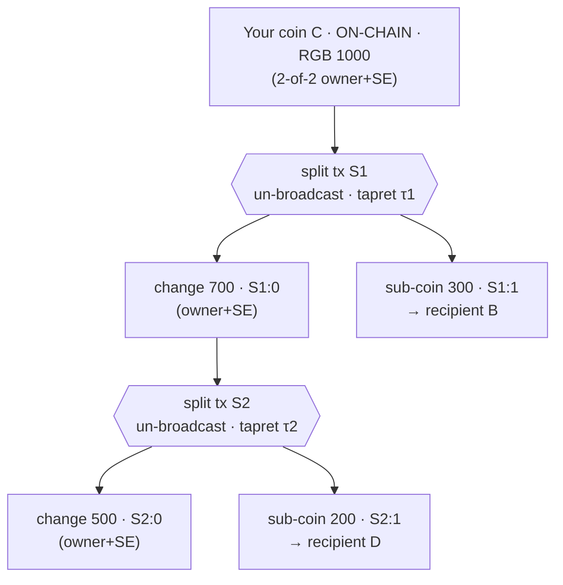
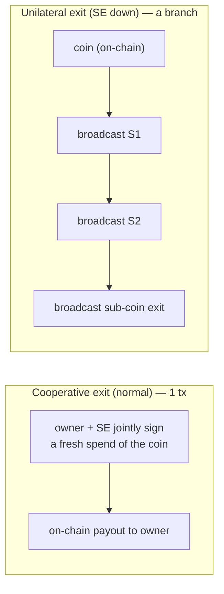

# Off-chain RGB splitting & combining on Mercury statechains

This document specifies how users **split, combine and transfer RGB allocations off-chain** on Mercury
statechains. Each user deposits their **own** tokens onto their own statechain coin, then carves and
merges sub-coins entirely off-chain — **no on-chain transaction and no per-piece on-chain cost** until
someone exits. There is **no operator and no custodian**: the only third party is the statechain
entity (SE), a blind 2-of-2 co-signer that enforces single-use. A recipient can receive a fraction
**without any on-chain onboarding of their own**, and any owner can **exit unilaterally** at any time.

The leaf-carving trick is adapted from pseudo-Spilman leaves (sub-coins are the spending tx's own
outputs); stale-state defence is the SE refusing a second spend, not a timelock race.

It builds on the statechain-as-RGB-seal primitives in the `mercury_rgb` bridge crate
(`clients/libs/rust-rgb`) and the orchestration in `clients/libs/rust/src/rgb.rs`.

## Why the existing flows are not enough

The partial-transfer and no-broadcast-transfer flows (`color_blinded` + the anchor-refresh
self-transfer) already move an allocation to **two** seals in one un-broadcast transition. But each
destination seal must be a **separately-funded statechain coin** — its own on-chain UTXO, onboarded by
its own Mercury deposit. So "split into N pieces" still costs **N on-chain UTXOs**, provisioned up
front. That is redistribution among pre-existing coins, not true splitting.

The goal here: carve N **new** sub-coins as **outputs of un-broadcast transactions** chained off the
owner's **own** coin. Zero on-chain cost per piece; the coin is the only thing that ever needs to be
mined (and only on exit).

## Two invalidation regimes (do not conflate them)

| | anchor-refresh / transfer (`refresh_rgb_anchor_self_transfer`) | off-chain split (this doc) |
|---|---|---|
| Model | **Replacement** — re-commit the *same* outpoint to a new state | **Chaining** — spend into *new* outpoints |
| Outpoint | unchanged (X → X, sats stay) | new sub-coins (children of the spend) |
| Stale-state defence | **decrementing nLockTime** (latest state wins the race) | **SE single-use per node** (no race needed — spends are sequential, a child can only confirm after its parent) |
| Needs DW timelocks? | the nLockTime *is* the DW-style mechanism | **no** — single-use makes the chain monotone |

A sub-coin, once created by a split (chaining), can later be **transferred** by the anchor-refresh
replacement model or **split again** by chaining. The two compose.

## Receiving a fraction without on-chain onboarding

A new user can receive a fraction with **zero on-chain transaction of their own** — the same property
as Ark/Spark or a Lightning receive:

- RGB lets you receive against a **witness seal**: instead of pointing at a UTXO you already own (a
  blinded seal, which *would* need on-chain presence), you hand the sender a **receive address**, and
  the sender carves an output to it inside the (un-broadcast) spending tx. **That output is your coin.**
- **Receive → hold → exit later** needs only a receive address. The first time Bitcoin is touched for
  you is *your* exit (or someone broadcasting the shared branch).
- **Receive → keep spending it off-chain** (re-split/combine your fraction with single-use protection)
  needs the address to be an SE 2-of-2 address, i.e. one **off-chain handshake** with the SE
  (`deposit/init` — an API call that sets up the key-share). Still **no Bitcoin transaction**.

Caveat: your off-chain fraction is only as safe as (a) the SE honouring single-use and (b) you holding
the **pre-signed exit branch** from an on-chain coin down to your output — that branch is what you
broadcast to exit if the SE goes dark, and what `validate_offchain_chain` checks.

## Transaction structure

```
on-chain:
   ┌─────────────────────────────┐
   │  your coin C  {owner, SE}    │  Mercury statechain coin, holds RGB allocation 1000
   └──────────────┬──────────────┘  (seal = C:0; anchored by the deposit, on-chain)
                  │
                  ▼
off-chain (un-broadcast, blind-MuSig2 co-signed with SE):
   split state S1 :  in  C:0  (SE single-use)
                     out S1:0  change  700  {owner, SE}     ← tapret here (your remaining coin)
                     out S1:1  to B    300  {B, SE}          ← seal (recipient B's sub-coin)
       RGB τ1: close(C:0) → { 700 @ tapret(S1:0), 300 @ tapret(S1:1) }
                  │
                  ▼  (chain the next split off your change)
   split state S2 :  in  S1:0  (SE single-use)
                     out S2:0  change  500  {owner, SE}      ← tapret here
                     out S2:1  to D    200  {D, SE}           ← seal (recipient D's sub-coin)
       RGB τ2: close(S1:0) → { 500 @ tapret(S2:0), 200 @ tapret(S2:1) }
```

Nothing above is broadcast. Each `S_i` is co-signed by `{owner-of-the-spent-coin, SE}` and carries the
RGB anchor (tapret) committing that split's transition. The sub-coins are **witness seals** on the
un-broadcast tx's own outputs — they cost no on-chain UTXO.

## RGB layer

- The allocation lives on a coin's **seal** and is split by each transition into
  `{recipient sub-seal, change seal}`. Multiple beneficiaries in one transition is the `color_psbt`
  `blinded_map` path — here using **witness** outputs (`output_map`) so the sub-coins are the tx's own
  outputs.
- **Off-chain validation of a *chain*.** A recipient of `S2:1` validates a consignment whose terminal
  transition is anchored in a chain of **un-broadcast** witnesses `S1, S2` rooted at an **on-chain**
  coin `C`. `validate_consignment_offchain_chain` / `OffchainResolver` (in `mercury_rgb`) resolves the
  whole branch of un-broadcast witnesses, not just one tx.

## Security

- **Single-use** is enforced by the SE refusing to co-sign a second spend of any node outpoint
  (`C:0`, `S1:0`, …). Because splits chain sequentially (a child spends its parent), there is **no
  old-vs-new race** within the split tree — a child cannot confirm before its parent. This is why
  chaining needs no decrementing timelock (unlike the replacement model). Verified by `rgb04`.
- **Epoch deadline.** Each coin may carry an `epoch_deadline`; the SE refuses any *new* co-signature
  once its clock passes it. Unilateral exit needs no SE co-signature, so the deadline only bounds when
  the owner must transact/exit by — funds are never stuck. Verified by `rgb07`.
- **Unilateral exit** = broadcast the branch from the on-chain coin down to your sub-coin (`C`'s spend
  `S1`, then `S2`, …) and settle the RGB consignment (anchors are now mined). Exit cost grows with
  chain depth — one tx per split on your path.
- **Trust = SE honest + exit before the epoch deadline.** Same profile as Spark/Ark; the growing
  collusion surface of a revocation model is avoided entirely.

## Architecture at a glance

The split tree lives **off-chain**; only the owner's coin is ever on Bitcoin (until an exit). Each
split is one un-broadcast, SE-co-signed transaction that consumes the prior coin and carves a recipient
sub-coin plus the owner's change, with the RGB transition committed in its tapret.



## Exit: cooperative (one tx) vs. unilateral (a branch)

The tree is *materialized* on Bitcoin only when someone exits — and **the normal path is a single
transaction**:

- **Cooperative exit — ONE on-chain tx (the normal flow).** The owner and the SE jointly sign a fresh
  transaction spending the on-chain coin directly to the owner's address; the SE "collapses" the
  branch, so the intermediate split txs are never broadcast. No timelock wait — just a 2-of-2 spend.
  The RGB allocation rides in that tx's commitment and the receiver settles with a standard `refresh`.
  (For a branch deeper than one level this collapse is a future refinement — see Next.)
- **Unilateral exit — a BRANCH of txs (only if the SE is uncooperative).** The owner broadcasts the
  pre-signed chain from the on-chain coin down to their sub-coin (coin-spend `S1`, then `S2`, … then
  the sub-coin's exit). Number of txs = the sub-coin's depth in the tree; deeper = more txs and more
  on-chain cost — the price of carving many sub-coins off one coin.

| | Cooperative (normal) | Unilateral (fallback) |
|---|---|---|
| **Mercury (flat, no tree)** | 1 tx (fresh 2-of-2 spend) | 1 tx (your backup tx, after a locktime wait) |
| **Spark / this design (tree)** | 1 tx (SE collapses your branch to a direct payout) | branch root→leaf, one tx per level |



## Relation to Spark (branches & leaves) — the forest model

Spark (<https://docs.spark.money/learn/core-concepts>) is the closest production design, and its shape
is the right target for "many independent deposits that combine and separate":

- **One tree per deposit → a forest.** Each on-chain deposit is its own tree; the network is a *forest*
  of independently-owned coins, not one shared root.
- **Leaves vs. branches.** *Leaves* are terminal, user-owned, and carry timelocks; *branches* are
  non-terminal and spendable by the **sum of the keys of the leaves under them**.
- **Additive key-splitting.** Splitting a leaf is a tx whose child outputs get keys *split from* the
  parent so that **Σ child keys = parent key**. Because children re-sum to the parent, leaves can be
  **re-aggregated (combined) off-chain by key arithmetic** — no on-chain tx, no multi-input signing for
  within-tree merges.
- **Transfer = sign-and-forget** (statechain key handover — what Mercury already does). **Unilateral
  exit** = broadcast the branch down to your leaf.

**How our pieces map:**

| Spark | This design (today) |
|---|---|
| Forest of per-deposit trees | Each Mercury deposit is an independent `{owner, SE}` statechain coin ✓ |
| Split a leaf | `rgb01` — one coin → N colored witness sub-coins ✓ |
| Aggregate / combine leaves | `rgb02`/`rgb05`/`rgb08` + `create_colored_combine_tx` — multi-input SE-co-signed tx (N coins → M outputs), off-chain validated, exited ✓ |
| Transfer | `refresh_rgb_anchor_self_transfer` (key rotation) ✓ |
| **Additive keys (Σ children = parent)** | **not yet** — we use independent per-coin keys, so combining needs a multi-input tx rather than key re-aggregation |

So the functional shape (forest + split + combine) is in place. The **one refinement Spark adds** is
*additive key derivation*: deriving each sub-coin's key as a split of its parent so within-tree combines
are pure key arithmetic (cheaper than the multi-input signing, and the basis for the "branch = sum of
leaf keys" unilateral-exit structure). That is the recommended next architectural step; the multi-input
combine remains the primitive for *cross-deposit* merges.

## What is new to build vs. reused

**Reused:** `register_statechain` (sub-coin as wallet UTXO); `color_psbt` with `output_map` (witness)
and `blinded_map` (multi-beneficiary transitions); `refresh_rgb_anchor_self_transfer` / the Mercury
`get_unsigned_backup_psbt` + `get_partial_sig_request_for_colored_tx` blind-MuSig2 co-sign;
`validate_consignment_offchain` + `OffchainResolver`; `refresh` to settle on exit.

**New (all done):**
1. **Multi-output colored split tx** — spend a coin into ≥2 colored witness outputs, one transition,
   un-broadcast (`rgb01`).
2. **Off-chain *chain* validation** — `OffchainResolver` resolves a whole branch of un-broadcast
   witnesses rooted at an on-chain coin (`rgb03`).
3. **SE single-use** — the SE refuses a second spend of any node outpoint (`rgb04`), applied to every
   node of the `rgb02`/`03`/`05`/`06`/`08` DAGs.
4. **Epoch deadline** — the SE refuses a new co-signature once its clock passes a coin's deadline
   (`rgb07`); unilateral exit needs no SE, so the deadline only bounds when to exit by.

## Working today (green E2E on regtest)

| Flow | What it proves |
|---|---|
| `rgb01` (RGB_E2E=1) | **Off-chain split** — your coin → N colored witness sub-coins in one un-broadcast tx; validated off-chain; exit by broadcast |
| `rgb02` (RGB_E2E=2) | **Combine (2-in)** — two coins → recipient + change in one SE-co-signed (per-input) un-broadcast tx |
| `rgb03` (RGB_E2E=3) | **2-deep off-chain chain** — un-broadcast split → un-broadcast combine; validated via `validate_offchain_chain([split, combine])` |
| `rgb04` (RGB_E2E=4) | **SE single-use** — a single-use coin's conflicting second spend is REFUSED (off-chain double-spend guard) |
| `rgb05` (RGB_E2E=5) | **Combine (3-in)** — three coins → one payment + change (the multi-input combine scales) |
| `rgb06` (RGB_E2E=6) | **3-level off-chain DAG** — split → combine → split, all un-broadcast; validated against `[S1,S2,S3]`; exited via the branch |
| `rgb07` (RGB_E2E=7) | **Epoch deadline** — SE co-signs inside the active period, REFUSES a new co-signature past the deadline, and unilateral exit (broadcasting a pre-co-signed branch) needs no SE call |
| `rgb08` (RGB_E2E=8) | **Wide combine (scale)** — combine N=6 of your own sub-coins in one SE-co-signed tx → a single payment + change; the combine primitive scales to many inputs |

Together these are the off-chain RGB DAG: each user deposits their own coin (a forest of roots),
transitions that **split and combine** (N→M) and **chain** (depth), validated off-chain, with the SE
as the single-use enforcer and a bounded exit window (`trust = SE honest + exit before the deadline`).
All of `rgb02`/`03`/`05`/`06`/`08` deposit every node as a **single-use** coin; `rgb01` stays on the
normal deposit+backup path as regression coverage.

Run (stack up; see the `rgb-statechain-run-env` memory / below):
```bash
cd clients/tests/rust
RGB_E2E=1 cargo +stable run   # ... up to RGB_E2E=8
```
The SE single-use + epoch checks require the matching mercury-server build (migration 0002 single_use
+ 0003 epoch_deadline + the `sign_first` refusals); in this dev env it is deployed by `docker cp` +
in-container `touch` + restart (the `docker compose build` cache does not pick up source changes here).

## Next

- **Cooperative-collapse exit (deep branches)** — the SE and owner co-sign a single coin→final-allocation
  tx instead of broadcasting the whole branch, so a deep chain still exits in one tx.
- **Additive key derivation** — derive each sub-coin's key as a split of its parent (Σ children =
  parent) so within-tree combines are pure key arithmetic instead of a multi-input tx.
- **Independent-deposit combine** — combine coins funded by *separate* on-chain deposits directly
  (today the combine tests fund their inputs by splitting one confirmed coin, to sidestep an rgb-lib
  stale-UTXO quirk on independently-funded colored UTXOs; the SE co-signs independent coins fine).

Done: robust single-use (single-use coins skip the deposit backup → uniform `>=1` SE threshold), the
epoch deadline, and the `rgb08` wide-combine scale test.
