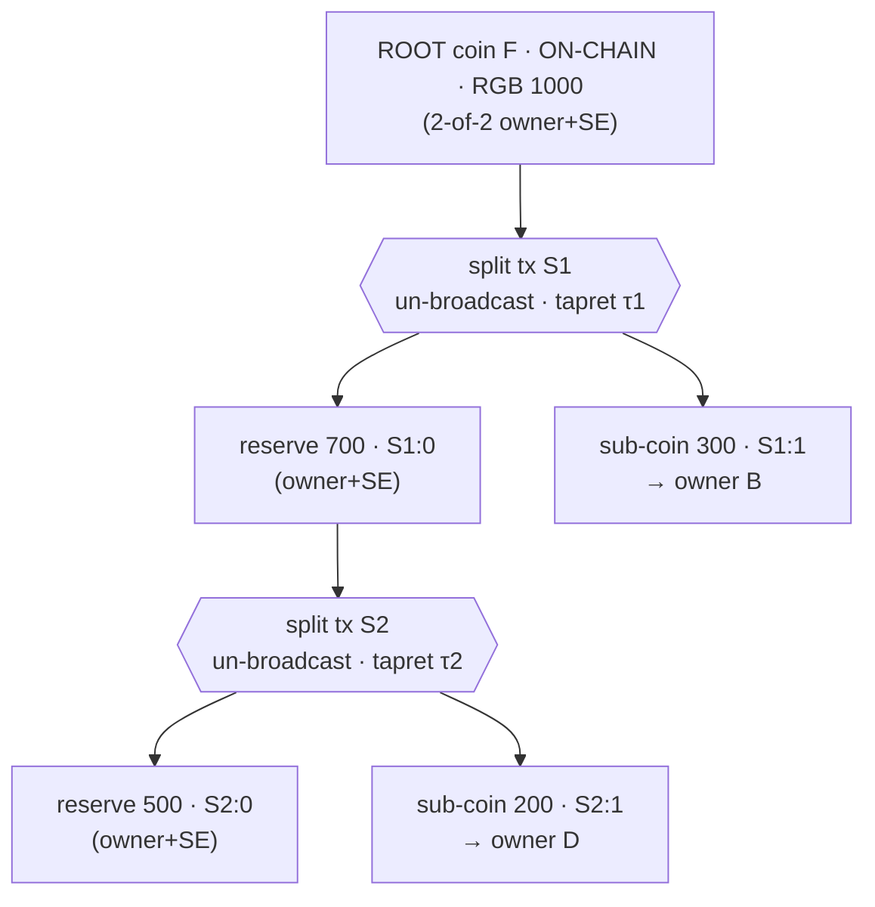
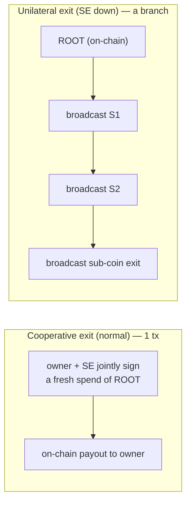

# Off-chain RGB splitting on statechains (pseudo-Spilman leaves)

This document specifies how to **split an RGB allocation off-chain** on a Mercury statechain — one
on-chain root UTXO fanned out into many sub-coins with **no on-chain transaction and no per-piece
on-chain cost** until someone exits. It adapts ZmnSCPxj's *SuperScalar: laddered timeout-tree
Decker-Wattenhofer factories with pseudo-Spilman leaves*
(<https://delvingbitcoin.org/t/.../1242>, <https://delvingbitcoin.org/t/.../1143>) to RGB single-use
seals on statechain coins.

It builds on the statechain-as-RGB-seal primitives implemented in the `mercury_rgb` bridge crate
(`clients/libs/rust-rgb`) and the orchestration in `clients/libs/rust/src/rgb.rs`. The only live RGB
E2E is `rgb01_offchain_split` (Stage 1, `RGB_E2E=1`); the earlier exploratory flows were removed in the move to
this architecture.

## Why the existing flows are not enough

The partial-transfer and no-broadcast-transfer flows (`color_blinded` + the anchor-refresh
self-transfer) already move an allocation to **two** seals in one un-broadcast transition. But each
destination seal must be a **separately-funded statechain coin** — its own on-chain UTXO, onboarded
by its own Mercury deposit.
So "split into N pieces" still costs **N on-chain UTXOs**, provisioned up front. That is redistribution
among pre-existing coins, not true splitting.

The goal here: carve N **new** sub-coins as **outputs of un-broadcast transactions** chained off a
**single** on-chain root. Zero on-chain cost per piece; the root is the only thing that ever needs to
be mined (and only on exit). This is exactly the SuperScalar factory property — amortize one on-chain
UTXO across many sub-allocations.

## Two invalidation regimes (do not conflate them)

| | anchor-refresh / transfer (`refresh_rgb_anchor_self_transfer`) | off-chain split (this doc) |
|---|---|---|
| Model | **Replacement** — re-commit the *same* outpoint to a new state | **Chaining** — spend into *new* outpoints |
| Outpoint | unchanged (X → X, sats stay) | new sub-coins (children of the spend) |
| Stale-state defence | **decrementing nLockTime** (latest state wins the race) | **SE single-use per node** (no race needed — spends are sequential, a child can only confirm after its parent) |
| Needs DW timelocks? | the nLockTime *is* the DW-style mechanism | **no** — only for *operator reclaim* and *in-place rebalance* (see Stage 4) |

A sub-coin, once created by a split (chaining), can later be **transferred** by the anchor-refresh
replacement model or **split again** by chaining. The two compose.

## Mapping SuperScalar → RGB-on-statechain

| SuperScalar | This design |
|---|---|
| LSP / coordinator `L` | Statechain operator (SE / lockbox) |
| Clients `A`, `B`, … | RGB sub-coin owners (splitter + recipients) |
| Funding UTXO + kickoff tx | The on-chain **root** statechain coin `F` and its kickoff |
| Pseudo-Spilman **leaf** state tx | A **split state tx**: spends a reserve, carves sub-coins + a new reserve |
| LN channel outputs (`A&L`, `B&L`) | **Sub-connectors** — `{owner, SE}` outputs that carry an RGB seal |
| Factory reserve `A&B&L or (L&CSV)` | The **reserve** output — unallocated remainder, with an `(SE & CLTV)` timeout branch |
| "Chain new state on top of old" (covenant-free honesty) | Each split tx **spends the prior reserve**; any party refuses to co-sign an invalid transition |
| DW decrementing `nSequence` (432→288→144→0) | Stage 4 only: invalidate an **in-place** factory update; latest confirms first |
| Old-state **poisoning** (`nLockTime`'d payout) | Stage 4 only: force the operator to publish the latest factory state |
| Timeout-tree `L & CLTV` reclaim, active/dying periods | Stage 4: operator reclaims unexited funds after the epoch; clients must exit before the deadline |

## Transaction structure

```
on-chain:
   ┌─────────────────────────────┐
   │  ROOT coin F  {owner, SE}    │  Mercury statechain coin, holds RGB allocation 1000
   └──────────────┬──────────────┘  (seal = F:0; anchored by the deposit, on-chain)
                  │  kickoff K (no timelock, n-of-n)   ── optional; F can be the first node directly
                  ▼
off-chain (un-broadcast, blind-MuSig2 co-signed with SE):
   split state S1 :  in  F:0  (SE single-use)
                     out S1:0  reserve  700  {owner, SE} (+ (SE&CLTV) in Stage 4)   ← tapret here
                     out S1:1  sub-coin  300 {B, SE}                                  ← seal
       RGB τ1: close(F:0) → { 700 @ tapret(S1:0), 300 @ tapret(S1:1) }
                  │
                  ▼  (chain the next split off the reserve)
   split state S2 :  in  S1:0  (SE single-use)
                     out S2:0  reserve  500  {owner, SE}                              ← tapret here
                     out S2:1  sub-coin  200 {D, SE}                                  ← seal
       RGB τ2: close(S1:0) → { 500 @ tapret(S2:0), 200 @ tapret(S2:1) }
```

Nothing above is broadcast. Each `S_i` is co-signed by `{controller-of-the-spent-reserve, SE}` and
carries the RGB anchor (tapret) committing that split's transition. The sub-coins are **witness
seals** on the un-broadcast tx's own outputs — they cost no on-chain UTXO.

## RGB layer

- The allocation lives on the **reserve seal** and is split by each transition into
  `{recipient sub-seal, new reserve seal}`. Multiple beneficiaries in one transition is the
  `color_psbt` `blinded_map` path — here using **witness** outputs (`output_map`) so the sub-coins
  are the tx's own outputs.
- **Off-chain validation of a *chain*.** A recipient of `S2:1` validates a consignment whose terminal
  transition is anchored in a chain of **un-broadcast** witnesses `S1, S2` rooted at the **on-chain**
  `F`. `validate_consignment_offchain` / `OffchainResolver` (in `mercury_rgb`) validates against
  **one** un-broadcast witness; the new work is to resolve a **branch** of un-broadcast witnesses (Stage 2).

## Security

- **Single-use** is enforced by the SE refusing to co-sign a second spend of any node outpoint
  (`F:0`, `S1:0`, …). Because splits chain sequentially (a child spends its parent), there is **no
  old-vs-new race** within the split tree — a child cannot confirm before its parent. This is why
  chaining needs no decrementing timelock (unlike the replacement model).
- **No stale full-exit.** Depositing into the factory means the root coin's Mercury backup/exit *is*
  the kickoff→chain, not a direct `1000 → owner` tx. So there is no conflicting "take it all" tx for
  the owner to broadcast later.
- **Unilateral exit** = broadcast the branch from the on-chain root down to your sub-coin (`F`'s spend
  `S1`, then `S2`, …) and settle the RGB consignment (anchors are now mined). Exit cost grows with
  chain depth — one tx per split on your path (the SuperScalar trade-off).
- **Trust = SE honest + (Stage 4) exit before the epoch deadline.** Same profile as Spark/Ark; the
  growing collusion surface of a revocation model is avoided entirely (see the revocation analysis in
  the conversation that produced this design).

## Architecture at a glance

The split tree lives **off-chain**; only the root is ever on Bitcoin (until an exit). Each split is one
un-broadcast, SE-co-signed transaction that consumes the prior reserve and carves a recipient sub-coin
plus a new reserve, with the RGB transition committed in its tapret.



## Exit: cooperative (one tx) vs. unilateral (a branch)

The tree is *materialized* on Bitcoin only when someone exits — and **the normal path is a single
transaction**:

- **Cooperative exit — ONE on-chain tx (the normal flow).** The owner and the SE jointly sign a fresh
  transaction spending the on-chain ROOT directly to the owner's address for their amount; the SE
  "collapses" the branch, so the intermediate split txs are never broadcast. No timelock wait — just a
  2-of-2 spend. The RGB allocation rides in that tx's commitment and the receiver settles with a
  standard `refresh`. This is how a healthy statechain leaves.
- **Unilateral exit — a BRANCH of txs (only if the SE is uncooperative).** The owner broadcasts the
  pre-signed chain from the on-chain root down to their sub-coin (ROOT-spend `S1`, then `S2`, … then
  the sub-coin's exit). Number of txs = the sub-coin's depth in the tree; deeper = more txs and more
  on-chain cost — the price of amortizing many sub-coins onto one UTXO. Decrementing relative-timelocks
  (Stage 4) order the broadcasts so the latest state confirms first.

| | Cooperative (normal) | Unilateral (fallback) |
|---|---|---|
| **Mercury (flat, no tree)** | 1 tx (fresh 2-of-2 spend) | 1 tx (your backup tx, after a locktime wait) |
| **Spark / this design (tree)** | 1 tx (SE collapses your branch to a direct payout) | branch root→leaf, one tx per level, with timelock waits |

So: **the normal flow is always a single on-chain transaction.** Broadcasting *multiple* transactions
happens **only** on a unilateral exit, and **only** in tree-based systems (Spark, and our split tree
once it is deeper than one level). Vanilla Mercury has no tree, so even its unilateral exit is one
backup tx. In Stage 1 (`rgb01`, depth-1) the "exit" is the single split tx itself; deeper trees
(Stage 2+) are where a unilateral exit becomes a multi-tx branch.



## Relation to Spark (branches & leaves) — the forest model

Spark (<https://docs.spark.money/learn/core-concepts>) is the closest production design, and its shape
is the right target for "hundreds of deposits that combine and separate":

- **One tree per deposit → a forest.** Each on-chain deposit becomes its own tree; the network is a
  *forest* of them, not one shared root. (This supersedes the single-root SuperScalar framing — that
  was the one-funder special case.)
- **Leaves vs. branches.** *Leaves* are terminal, user-owned, and carry timelocks; *branches* are
  non-terminal, have **no** timelock, and are spendable by the **sum of the keys of the leaves under
  them**.
- **Additive key-splitting.** Splitting a leaf is a tx whose child outputs get keys *split from* the
  parent so that **Σ child keys = parent key**. Because children re-sum to the parent, leaves can be
  **re-aggregated (combined) off-chain by key arithmetic** — no on-chain tx, no multi-input signing
  for within-tree merges.
- **Transfer = sign-and-forget** (statechain key handover — what Mercury already does). **Unilateral
  exit** = broadcast the branch down to your leaf.

**How our pieces map:**

| Spark | This design (today) |
|---|---|
| Forest of per-deposit trees | Each Mercury deposit is an independent `{owner, SE}` statechain coin (a root) ✓ |
| Split a leaf | `rgb01` — one coin → N colored witness sub-coins ✓ |
| Aggregate / combine leaves | `rgb02` + `create_colored_combine_tx` — multi-input SE-co-signed tx (N coins → M outputs). **Green E2E at N=2**: combine two statechain coins (600+400) → recipient 700 + change 300, SE co-signed per input, off-chain validated, exited. Inputs funded by splitting a confirmed ROOT to two Mercury deposit addresses (sidesteps an rgb-lib stale-UTXO quirk on multi-coin deposits) ✓ |
| Transfer | `refresh_rgb_anchor_self_transfer` (key rotation) ✓ |
| **Additive keys (Σ children = parent)** | **not yet** — we use independent per-coin keys, so combining needs a multi-input tx rather than key re-aggregation |

So the functional shape (forest + split + combine) is in place. The **one refinement Spark adds** is
*additive key derivation*: deriving each sub-coin's key as a split of its parent so within-tree
combines are pure key arithmetic (cheaper than `rgb02`'s multi-input signing, and the basis for the
"branch = sum of leaf keys" unilateral-exit structure). That is the recommended next architectural
step; `rgb02`'s multi-input combine remains the primitive for *cross-tree* merges (different deposits),
which Spark mediates through the operator regardless.

## What is new to build vs. reused

**Reused:** `register_statechain` (sub-coin as wallet UTXO); `color_psbt` with `output_map` (witness)
and `blinded_map` (multi-beneficiary transitions);
`refresh_rgb_anchor_self_transfer` / the Mercury `get_unsigned_backup_psbt` +
`get_partial_sig_request_for_colored_tx` blind-MuSig2 co-sign; `validate_consignment_offchain` +
`OffchainResolver`; `refresh` to settle on exit.

**New:**
1. **Multi-output colored split tx** — spend a reserve into ≥2 colored witness outputs + a reserve,
   one transition, un-broadcast (Stage 1).
2. **Off-chain *chain* validation** — `OffchainResolver` returns a whole branch of un-broadcast
   witnesses rooted at an on-chain UTXO (Stage 2).
3. **SE single-use ledger** — the lockbox tracks, per node outpoint, the one transition it co-signed,
   and refuses conflicts (Stage 3).
4. **Epoch deadline (Stage 4, DONE)** — the SE refuses any new co-signature once its own clock passes
   a coin's `epoch_deadline` (unix seconds; migration 0003 + the `sign_first` gate). Unilateral exit
   needs no SE co-signature, so the deadline only bounds *when the owner must transact/exit by*; funds
   are never stuck. This makes the trust model real: `SE honest + exit before the deadline`. The
   on-chain counterpart — a reserve `(SE & CLTV)` timeout branch + DW decrementing `nSequence` +
   poisoning for *operator reclaim* and *in-place rebalance* — needs taproot script-path tweaking of
   the aggregate output key and folds into the multi-owner factory work (Stage 5).
5. **Multi-owner factory (Stage 5, core DONE)** — one on-chain root amortized across many *distinct*
   owners (each a separate wallet with its own keys), demonstrated by `rgb09`: the operator splits the
   root off-chain to N owners, each independently validates + exits its own allocation. The advanced
   variant where owners JOINTLY control the root via n-of-n MuSig2 and co-sign in-place updates (so
   each owner can refuse an invalid factory update) needs multi-party keygen in the lockbox — future.

## Working today (green E2E on regtest)

| Flow | What it proves |
|---|---|
| `rgb01` (RGB_E2E=1) | **Off-chain split** — root coin → N colored witness sub-coins in one un-broadcast tx; validated off-chain; exit by broadcast |
| `rgb02` (RGB_E2E=2) | **Combine (2-in)** — two statechain coins → recipient + change in one SE-co-signed (per-input) un-broadcast tx |
| `rgb03` (RGB_E2E=3) | **2-deep off-chain chain** — un-broadcast split → un-broadcast combine; SE co-signs spends of un-broadcast outputs; validated via `validate_offchain_chain([split, combine])` (two un-broadcast witnesses) |
| `rgb04` (RGB_E2E=4) | **SE single-use** — a single-use coin's conflicting second spend is REFUSED (off-chain double-spend guard) |
| `rgb05` (RGB_E2E=5) | **Combine (3-in)** — three coins → one payment + change (the multi-input combine scales) |
| `rgb06` (RGB_E2E=6) | **3-level off-chain DAG** — split → combine → split, all un-broadcast; validated via `validate_offchain_chain([S1,S2,S3])`; exit by broadcasting the branch |
| `rgb07` (RGB_E2E=7) | **Epoch deadline (Stage 4)** — SE co-signs inside the active period, REFUSES a new co-signature once its clock passes the deadline, and unilateral exit (broadcasting a pre-co-signed branch) needs no SE call |
| `rgb08` (RGB_E2E=8) | **Wide combine (scale)** — ROOT split into N=6 single-use+epoch sub-coins, then all 6 combined in one SE-co-signed tx → recipient + change, exited in a SINGLE on-chain tx (N deposits, one footprint — on-chain cost is constant regardless of deposit count) |
| `rgb09` (RGB_E2E=9) | **Multi-owner factory (Stage 5)** — one root UTXO (single-use+epoch) split off-chain to N=3 **distinct owner wallets**; each independently validates its own allocation off-chain and settles it on-chain; one exit tx materializes every owner's coin (one root amortized across many sovereign owners) |

Together these are the off-chain RGB DAG: deposits (roots), transitions that **split and combine**
(N→M) and **chain** (depth), validated off-chain, with the SE as the single-use enforcer — and, with
the epoch deadline, a bounded exit window (`trust = SE honest + exit before the deadline`). All of
`rgb02`/`03`/`05`/`06` deposit every node as a **single-use** coin, so the whole forest+DAG is SE
double-spend-protected; `rgb01` stays on the normal deposit+backup path as regression coverage.

Run (stack up; see the `rgb-statechain-run-env` memory / below):
```bash
cd clients/tests/rust
RGB_E2E=1 cargo +stable run   # ... up to RGB_E2E=9
```
The SE single-use + epoch checks require the matching mercury-server build (migration 0002 single_use
+ 0003 epoch_deadline + the `sign_first` refusals); in this dev env it is deployed by `docker cp` +
in-container `touch` + restart (the `docker compose build` cache does not pick up source changes here).

## Next

- **On-chain reserve reclaim** — a reserve `(SE & CLTV)` timeout branch + DW decrementing `nSequence`
  + poisoning for *operator reclaim* and *in-place rebalance*. Needs taproot script-path tweaking of
  the aggregate output key (the SE-enforced epoch deadline already gives the bounded-exit guarantee).
- **Cooperative-collapse exit** — operator co-signs a single root→final-allocation tx instead of
  broadcasting the branch (the normal 1-tx exit).
- **n-of-n joint factory** — owners JOINTLY control the root (multi-party MuSig2 in the lockbox) and
  co-sign in-place updates, so each owner can refuse an invalid factory update. The `rgb09` factory
  already amortizes one root across many *distinct* owners (operator-distributes shape).

Done: robust single-use (single-use coins skip the deposit backup → uniform `>=1` SE threshold), the
Stage 4 epoch deadline, the `rgb08` wide-combine scale test, and the `rgb09` multi-owner factory.
